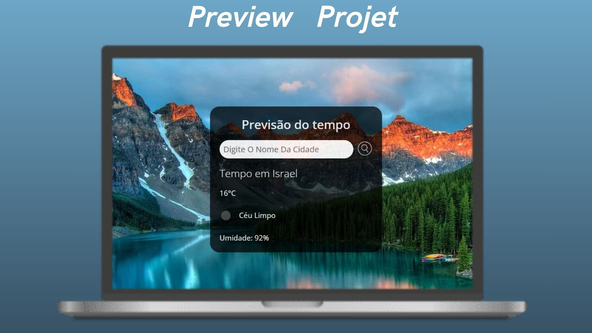

# ⛈️ Previsao-do-TempoJS 🌤️

Previsão do Tempo Web desenvolvida com HTML, CSS e JAVASCRIPT.

## 🔥 Introdução
Um projeto de previsão do tempo que utiliza uma API para obter informações em tempo real da cidade que você procurar.

Este projeto foi feito para exercitar o JavaScript puro e a sua base que é muito importante.

Foi aplicado nesse projeto conceitos de JS como funções, funções assíncronas, manipulando elementos com o DOM, e consumindo API do tempo.

Neste projetos usamos boas práticas de desenvolvimento.✔️

Projeto simples mas que exercita muito bem a base do desenvolvimento Web.

### 📦 Tecnologias usadas

* 
* 
* 

